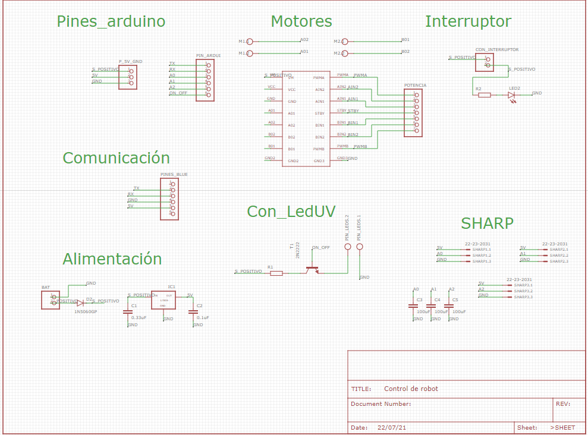
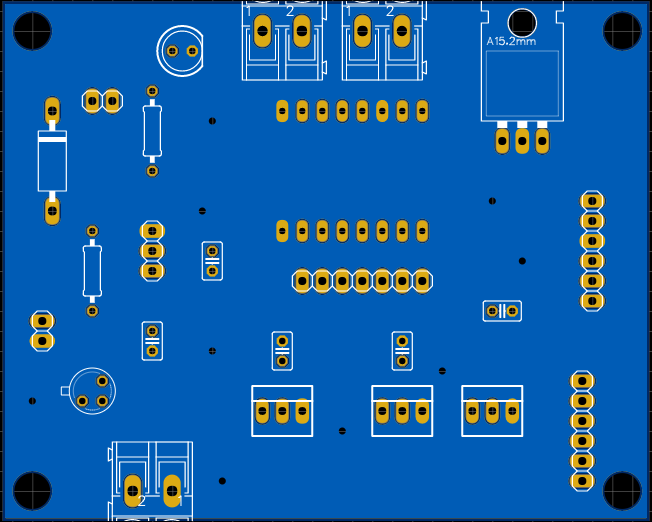

# Wall-Follower-Robot
En este proyecto se diseño un Robot que fuera capaz de seguir una pared a una distancia que pueda ser previamente definida por el usuario y esquivar obstaculos. Los materiales usasdos para el diseño y creacion del proyecto se encuentra en la documetación que se devia entregar como parte del proyecto. Hay que agregar que el robot tenia un sistema de luces UV para desinfectar el ambiente pero estas terminaron siendo decorativas debido a que las luces eran UVA y para la desinfección se suele usar UVC, era difícil conseguir en pandemia luces con una menor longitud de onda ademas del inconvenoente de trabajar con luces que puedan causar quemaduras en la piel.

## Esquematico

## PCB

## Aplicación
Se diseñó una aplicación para hacer la ccomuniación conn el robot, en esta parte lo unico que se tuvo que programar el modulo USART. El apk de la aplicación se encuentra en la documentación.

## Conclusion y mejoras a futuro

El robot tuvo exito en lograr seguir una pared pero poco exito a la hora de esquivar obstaculos ademas de que el seguimiento de pared a veces el sistema de control no era capaz de correguir el rumbo del robot cuanddo tomaba angulos muy pronunciados con respecto a la pared, esto se debe a que la disposición de los sensores no fue la mejor. Para mejoras a futuro se puede probar colocando dos sensores en los laterales. Además es posible que los sensosres ultra sonicos tengan mejores resultados que los sensores Chart.

## Links
 - Link para descargar el esquematico y  PCB https://oshwlab.com/Santiago77/robot-seguir-de-pared
 - Link del video donde se baso el diseño del controlador fuzzy https://www.youtube.com/watch?v=KDdm_DOEzpI

## Agradecimientos
Este proyecto no fue hecho por solo una persona......
